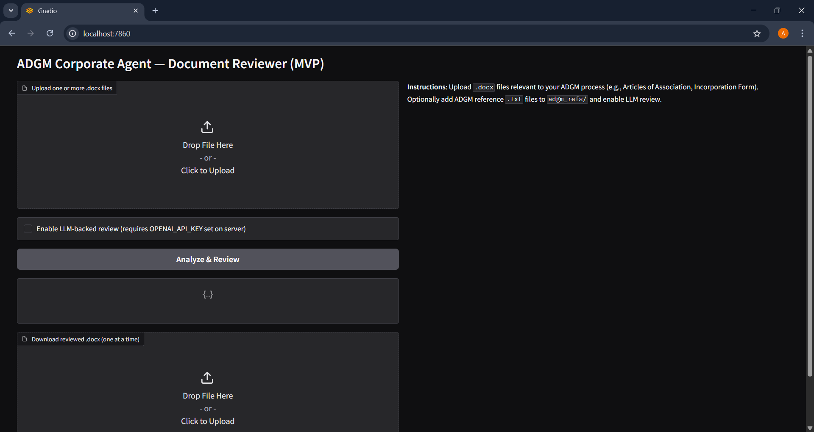
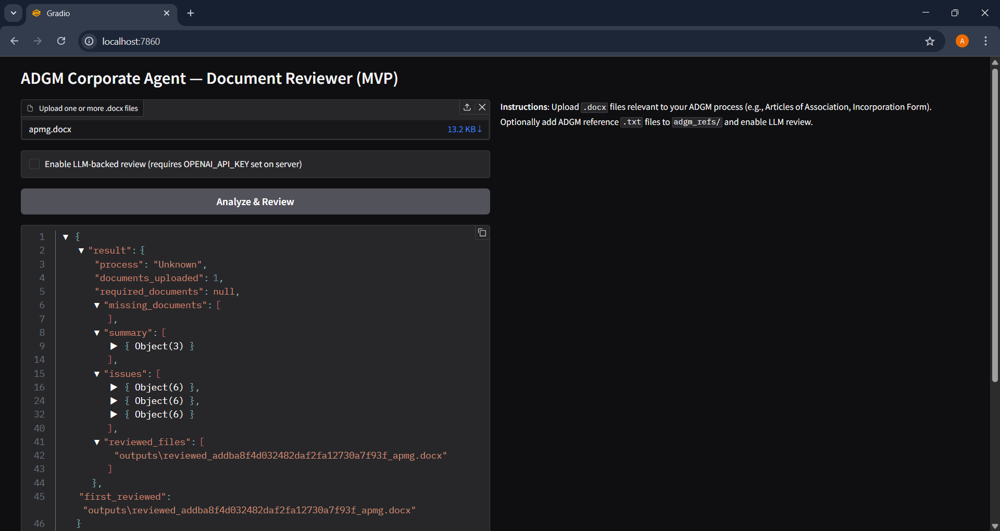
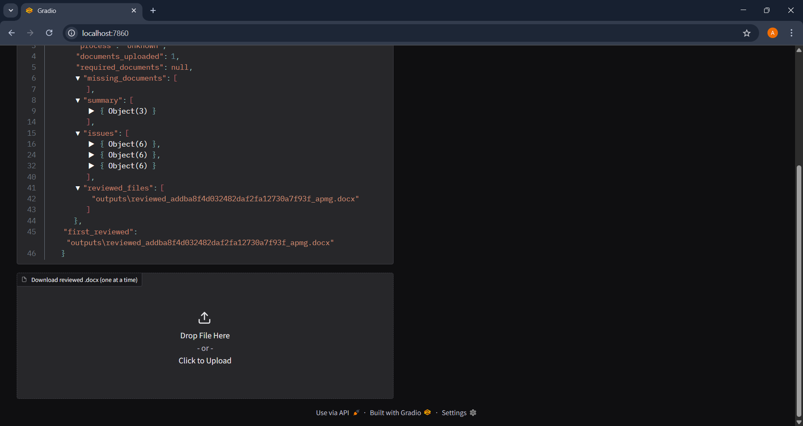

# ADGM Corporate Agent — Document Reviewer (MVP)

## Overview
This repository contains a minimal working prototype of an ADGM-compliant "Corporate Agent" that:
- Accepts `.docx` files
- Performs simple detection of document types
- Compares uploaded docs to a checklist (Company Incorporation)
- Runs heuristic red-flag detection
- Optionally performs RAG + LLM review (requires reference texts in `adgm_refs/` and `OPENAI_API_KEY`)
- Produces a reviewed `.docx` with inline bracketed comments and a JSON summary.

## Project Run Proof

Here’s the proof screenshot of the project running:





## Setup


2. Create and activate Python venv (recommended):
```bash
python -m venv venv
venv\\Scripts\\activate
pip install -r requirements.txt


